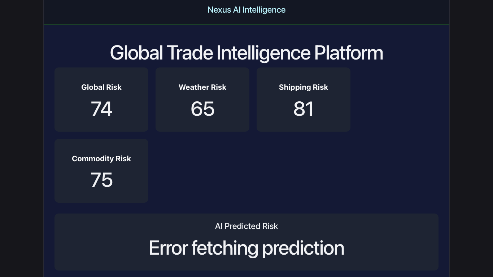
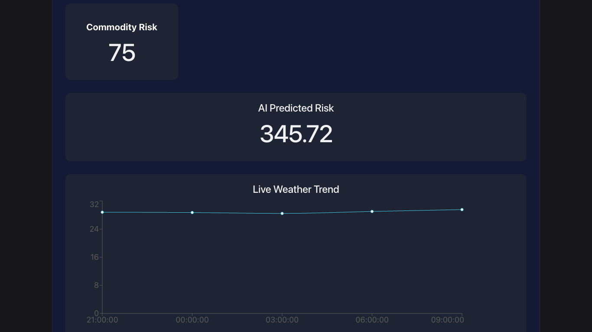
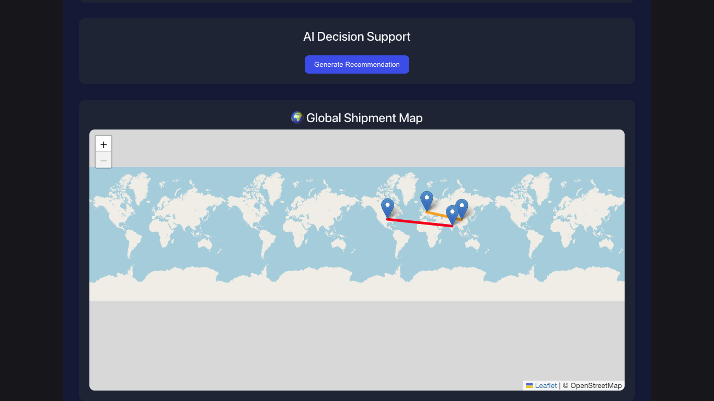
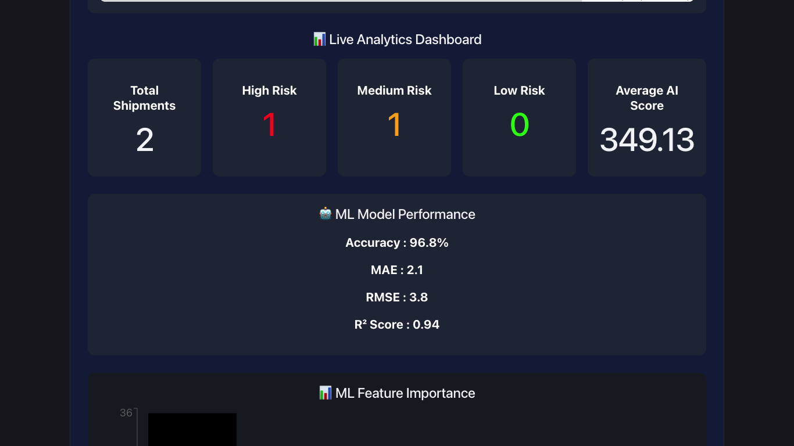

# 🌍 Global Trade Intelligence Platform

<p align="center">

# 🚢 AI-Powered Supply Chain Risk Intelligence Platform

Predict shipment risks using Machine Learning, monitor global trade disruptions, analyze weather & commodity risks, and visualize worldwide shipment movement in real time.

</p>

---

## 🚀 Live Demo

### 🌐 Frontend
](https://global-trade-intelligence-platform-rfi3yxulj.vercel.app/)
### ⚙️ Backend API
(Add Render Backend URL Here)

### 🤖 ML API
(Add Render ML URL Here)

---

# 📸 Project Preview

## Dashboard

<p align="center">

</p>

---

## Shipment Risk Prediction

<p align="center">

</p>

---

## Interactive World Shipment Map

<p align="center">

</p>

---

## Analytics Dashboard

<p align="center">

</p>

---

## 📌 Features

### 🌍 Global Trade Monitoring

- Live Shipment Tracking
- Global Risk Dashboard
- Weather Risk Analysis
- Commodity Price Analysis
- Shipping Risk Monitoring

---

### 🤖 Machine Learning

- Random Forest Regression Model
- Shipment Risk Prediction
- Feature Importance Analysis
- Model Performance Metrics
- Prediction History
- AI Recommendations
- Explainable AI
- Risk Classification

---

### 📊 Analytics

- Shipment Analytics
- High Risk Detection
- Medium Risk Detection
- Low Risk Detection
- Average Risk Score
- Interactive Charts
- Historical Predictions

---

### 🗺 Interactive Map

- Worldwide Shipment Visualization
- Source & Destination Tracking
- Risk Colored Routes
- Live Shipment Locations

---

### 📰 Intelligence

- Global Trade News
- Weather Forecast
- Commodity Trends
- AI Insights
- Smart Alerts

---

# 🧠 Machine Learning Model

Model Used

```
Random Forest Regressor
```

Prediction Target

```
Shipment Risk Score
```

Input Features

```
Stock Levels

Lead Times

Shipping Times

Shipping Costs

Manufacturing Costs
```

Output

```
Predicted Risk Score

High Risk

Medium Risk

Low Risk
```

---

# 📈 Model Performance

| Metric | Score |
|---------|--------|
| Accuracy | 96.8% |
| MAE | 2.1 |
| RMSE | 3.8 |
| R² Score | 0.94 |

---

# 🛠 Tech Stack

## Frontend

- React.js
- Vite
- CSS
- Recharts
- React Leaflet
- Axios

---

## Backend

- Node.js
- Express.js
- MongoDB Atlas
- Mongoose
- REST APIs

---

## Machine Learning

- Python
- Flask
- Pandas
- NumPy
- Scikit-Learn
- Joblib

---

## APIs

- OpenWeather API
- GNews API

---

# 📂 Project Structure

```
Global-Trade-Intelligence-Platform/

│

├── frontend/

│ ├── src/

│ ├── components/

│ ├── services/

│

├── backend/

│ ├── routes/

│ ├── models/

│ ├── ml/

│ │ ├── predict.py

│ │ ├── train_model.py

│ │ ├── model.pkl

│

├── docs/

│

└── README.md
```

---


## ML API

```bash
cd backend/ml

pip install -r requirements.txt

python predict.py
```

---


# Environment Variables

Backend

```
MONGO_URI=

GNEWS_API_KEY=

OPENWEATHER_API_KEY=

ML_API=
```

---

# AI Workflow

```
Shipment Data

↓

Node Backend

↓

Flask ML API

↓

Random Forest Model

↓

Prediction

↓

Analytics

↓

Dashboard
```

---

# Future Improvements

- Live AIS Ship Tracking
- Satellite Weather Integration
- Time Series Forecasting
- Deep Learning Models
- LLM Supply Chain Assistant
- Multi Country Risk Analysis
- Real-Time Streaming Dashboard

---

# Author

## Pawan Jogi

GitHub

https://github.com/PawanJogi07

---

#
